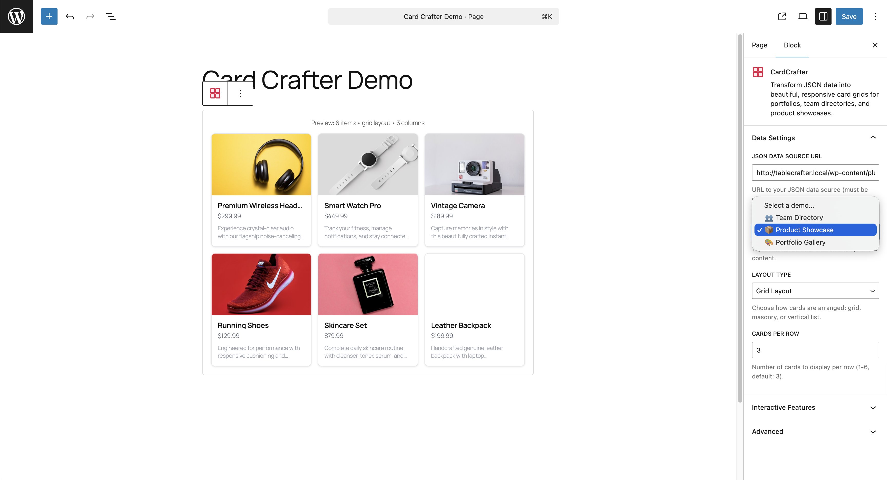

# CardCrafter – Data-Driven Card Grids

[](https://wordpress.org/plugins/cardcrafter-data-grids/)
[](https://github.com/TableCrafter/cardcrafter-data-grids/releases)
[](https://wordpress.org/plugins/cardcrafter-data-grids/)
[](LICENSE)

Transform JSON data into beautiful, responsive card grids for WordPress. Perfect for team directories, product showcases, and portfolio displays.

🚀 **[Try Live Demo](https://tastewp.com/plugins/cardcrafter-data-grids)** - Test CardCrafter instantly without installation!

---

## 🚀 Features

### 🧱 Gutenberg Block Support
- **Native WordPress Block Editor** integration with visual configuration
- **Professional 4-card grid icon** following WordPress design standards
- **Sidebar controls** for data source selection, layout options, and interactive features
- **Live preview** in block editor matching frontend output
- **Demo data integration** for quick testing and prototyping

### ⚡ Core Features
- **Zero Database Impact** - Fetches data directly from JSON endpoints
- **Multiple Layouts** - Grid, Masonry, and List views
- **Responsive Design** - Cards adapt perfectly to any screen size
- **Interactive Search & Sort** - Client-side filtering and alphabetical sorting
- **Smart Field Mapping** - Automatically detects common data fields
- **Performance First** - Pure JavaScript, no jQuery, lightweight caching
- **Dark Mode Ready** - Automatically adapts to dark color schemes

## 🎯 Perfect For

- **👥 Team Directories** - Showcase team members with photos and bios
- **📦 Product Catalogs** - Display products with images, prices, and descriptions
- **🎨 Portfolio Galleries** - Present work in elegant grid layouts
- **🛍️ Service Listings** - Highlight services with card-based layouts
- **💬 Testimonials** - Display customer reviews in beautiful cards

## 📦 Installation

### Option 1: WordPress Admin (Recommended)
1. Go to **Plugins** → **Add New** in your WordPress admin
2. Search for "CardCrafter Data Grids"
3. Click **Install Now** and then **Activate**

### Option 2: Manual Installation
1. Download from [WordPress.org](https://wordpress.org/plugins/cardcrafter-data-grids/) or [GitHub Releases](https://github.com/TableCrafter/cardcrafter-data-grids/releases)
2. Upload the `cardcrafter-data-grids` folder to `/wp-content/plugins/`
3. Activate through **Plugins** → **Installed Plugins**

### Quick Start
- **Block Editor:** Add the "CardCrafter" block to any post/page
- **Classic Editor:** Use shortcode `[cardcrafter-data-grids source="your-json-url"]`
- **Admin Demo:** Go to **CardCrafter** menu to test with demo data

## 🔧 Usage

### Gutenberg Block (Recommended)
1. Add the "CardCrafter" block to any post/page
2. Configure your data source in the sidebar settings
3. Choose layout, columns, and interactive features
4. Preview updates live in the editor

### Shortcode (Classic Editor)

#### Basic Usage
```php
[cardcrafter-data-grids source="https://api.example.com/team.json"]
```

#### Advanced Configuration
```php
[cardcrafter-data-grids 
    source="https://api.example.com/products.json" 
    layout="masonry" 
    columns="4"
    search="true"
    sort="true"
]
```

### Shortcode Attributes

| Attribute | Description | Default | Options |
|-----------|-------------|---------|---------|
| `source` | JSON data URL (required) | - | Any valid URL |
| `layout` | Card layout type | `grid` | `grid`, `masonry`, `list` |
| `columns` | Cards per row | `3` | `2`, `3`, `4`, `5`, `6` |
| `search` | Enable search filtering | `true` | `true`, `false` |
| `sort` | Enable sorting options | `true` | `true`, `false` |
| `image_field` | JSON field for images | `image` | Any field name |
| `title_field` | JSON field for titles | `title` | Any field name |
| `subtitle_field` | JSON field for subtitles | `subtitle` | Any field name |
| `description_field` | JSON field for descriptions | `description` | Any field name |
| `link_field` | JSON field for links | `link` | Any field name |

## 📊 JSON Data Format

CardCrafter expects an array of objects. Each object should contain your card data:

```json
[
  {
    "image": "https://example.com/person1.jpg",
    "title": "John Doe",
    "subtitle": "Frontend Developer",
    "description": "Passionate about creating beautiful user interfaces.",
    "link": "https://johndoe.com"
  },
  {
    "image": "https://example.com/person2.jpg",
    "title": "Jane Smith",
    "subtitle": "UX Designer",
    "description": "Focused on user-centered design principles.",
    "link": "https://janesmith.com"
  }
]
```

### Custom Field Names
If your JSON uses different field names, specify them in the shortcode:

```php
[cardcrafter-data-grids 
    source="https://api.example.com/staff.json"
    image_field="photo"
    title_field="name"
    subtitle_field="position"
    description_field="bio"
    link_field="profile_url"
]
```

## 🎨 Customization

### CSS Variables
CardCrafter uses CSS custom properties that you can override:

```css
:root {
  --cc-card-bg: #ffffff;
  --cc-card-border: #e2e8f0;
  --cc-card-shadow: 0 4px 6px rgba(0, 0, 0, 0.1);
  --cc-card-radius: 8px;
  --cc-text-primary: #1a202c;
  --cc-text-secondary: #718096;
}
```

### Custom CSS Classes
All cards include these CSS classes for styling:

- `.cardcrafter-grid` - Main container
- `.cardcrafter-card` - Individual card
- `.cardcrafter-image` - Card image
- `.cardcrafter-title` - Card title
- `.cardcrafter-subtitle` - Card subtitle
- `.cardcrafter-description` - Card description

## 🚀 Performance Features

- **Secure Data Proxy** - Bypasses CORS restrictions
- **SWR Caching** - Stale-While-Revalidate for blazing-fast load times
- **Rate Limiting** - 30 requests/minute to prevent abuse
- **Error Recovery** - Intelligent diagnostics and retry mechanisms
- **Lightweight** - No jQuery dependency, pure modern JavaScript

## 🔒 Security

- **SSRF Protection** - Validates and sanitizes all URLs
- **Input Sanitization** - All user inputs are properly escaped
- **Output Escaping** - Prevents XSS attacks
- **Rate Limiting** - Protects against API abuse
- **WordPress Standards** - Follows WordPress security best practices

## 📸 Screenshots

| Block Editor | Grid Layout | Masonry Layout |
|--------------|-------------|----------------|
|  |  |  |

*More screenshots available in the [WordPress.org plugin directory](https://wordpress.org/plugins/cardcrafter-data-grids/#screenshots).*

## ❓ FAQ

### What JSON format does CardCrafter expect?
CardCrafter works with arrays of objects. Each object represents one card with fields like `image`, `title`, `subtitle`, `description`, and `link`. Field names are customizable.

### Can I customize the card design?
Yes! CardCrafter uses CSS custom properties that you can override in your theme. All cards have clear class names for advanced styling.

### Does this work with any API?
CardCrafter works with any publicly accessible JSON endpoint. Our secure proxy handles CORS restrictions automatically.

### Is it compatible with page builders?
Yes! CardCrafter works with:
- **Gutenberg** (native block support)
- **Elementor** (via shortcode widget)
- **Beaver Builder** (via shortcode module)
- **Divi** (via code module)
- Any page builder that supports shortcodes

### Can I use it with WooCommerce?
Absolutely! CardCrafter is perfect for displaying WooCommerce products from external APIs or creating custom product showcases.

## 🔄 Changelog

### 1.3.0 (Latest)
- ✨ **NEW:** Native Gutenberg Block support with visual configuration
- ✨ **NEW:** Professional 4-card grid icon design
- ✨ **NEW:** Block editor sidebar controls and demo data integration
- ✨ **NEW:** Live preview in block editor
- 📖 **IMPROVED:** Enhanced installation documentation
- 📸 **IMPROVED:** Comprehensive screenshot descriptions

### 1.2.0
- ✨ **NEW:** Interactive Search Toolbar with client-side filtering
- ✨ **NEW:** Sorting functionality (A-Z, Z-A)
- 🎨 **IMPROVED:** Modern styles for search inputs and dropdowns

### 1.1.4
- 🔒 **SECURITY:** Rate limiting (30 requests/minute) on AJAX proxy
- 🔒 **SECURITY:** Robust client identification for proxies
- 🐛 **FIX:** Standard HTTP 429 response for rate limit exceeded

*[View full changelog →](CHANGELOG.md)*

## 🤝 Contributing

We welcome contributions! Please see our [Contributing Guidelines](CONTRIBUTING.md) for details.

### Development Setup
```bash
git clone https://github.com/TableCrafter/cardcrafter-data-grids.git
cd cardcrafter-data-grids
# Install in WordPress plugins directory
ln -s $(pwd) /path/to/wordpress/wp-content/plugins/cardcrafter-data-grids
```

## 📄 License

This project is licensed under the GPL v2 or later - see the [LICENSE](LICENSE) file for details.

## 🔗 Links

- **WordPress.org:** https://wordpress.org/plugins/cardcrafter-data-grids/
- **GitHub:** https://github.com/TableCrafter/cardcrafter-data-grids
- **TableCrafter Suite:** https://tablecrafter.com
- **Support:** [GitHub Issues](https://github.com/TableCrafter/cardcrafter-data-grids/issues)

---

<div align="center">

**[Download from WordPress.org](https://wordpress.org/plugins/cardcrafter-data-grids/) • [View Live Demo](https://cardcrafter.tablecrafter.com) • [GitHub](https://github.com/TableCrafter/cardcrafter-data-grids)**

*Made with ❤️ by the TableCrafter team*

</div>